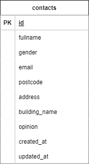

#アプリケーション名  
お問い合わせフォーム(検索機能付き)

![alt text][index]

##作成した目的  
Advance テストのため

##機能一覧

- お問い合わせ作成画面
  - バリデーション機能
- 確認画面
  - 修正ボタン(作成画面への遷移)
- サンクスページ
- 検索画面
  - 検索機能
  - 削除機能

##使用技術

- Laravel 8.x
- PHP 7.4.9
- MySQL 8.0.26

##テーブル設計

| カラム名      | 型              | 説明                |
| ------------- | --------------- | ------------------- |
| id            | unsigned bigint | 主キー              |
| fullname      | varchar(255)    | お名前              |
| gender        | tinyint         | 性別(1.男性 2.女性) |
| email         | varchar(255)    | メールアドレス      |
| postcode      | char(8)         | 郵便番号            |
| address       | varchar(255)    | 住所                |
| building_name | varchar(255)    | 建物名(NULL 許容)   |
| opinion       | text(120)       | ご意見              |
| created_at    | timestamp       | 作成日              |
| updated_at    | timestamp       | 更新日              |

##ER 図

##環境構築

- Docker ビルド

  1. git clone git@github.com:coachtech-material/laravel-docker-template.git
  2. docker-compose up -d --build

- Docker 環境構築

  1. docker-compose exec php bash
  2. composer install
  3. .env.example ファイルから.env を作成し、環境変数を変更
  4. php artisan key:generate
  5. php artisan migrate (contacts テーブルの作成)
  6. php artisan db:seed (シーディングの実行)

##URL

- 開発環境:http://localhost/
- phpMyAdmin:http://localhost:8080/

[def]: image.png
[index]: image-1.png
